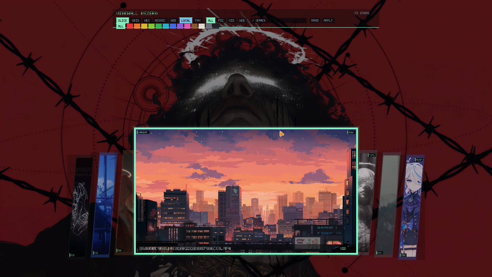
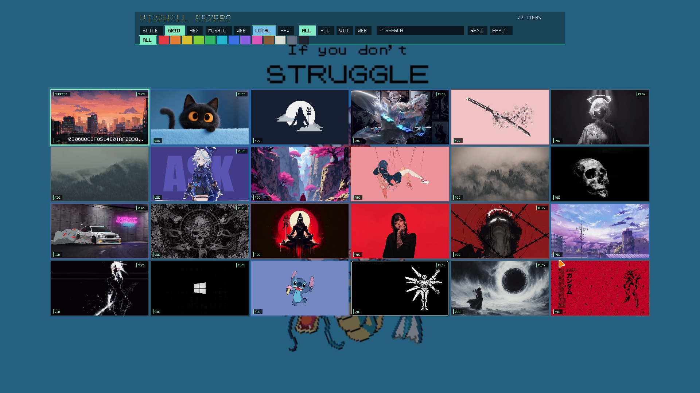
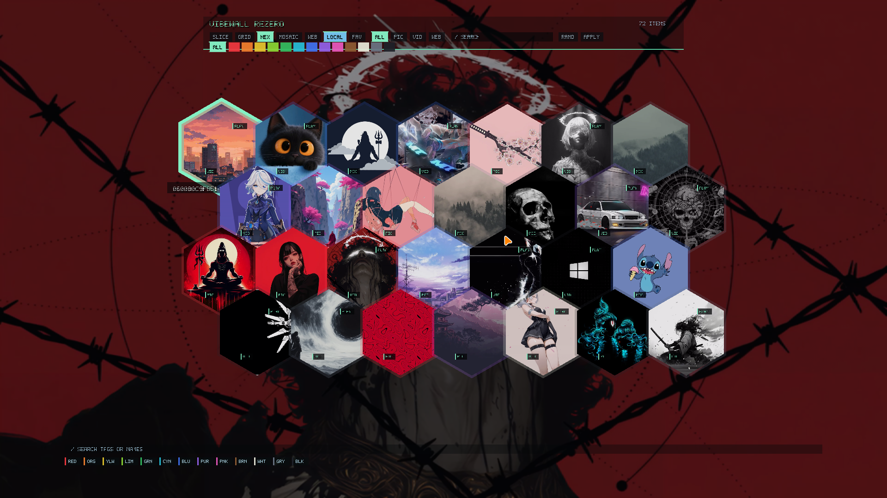
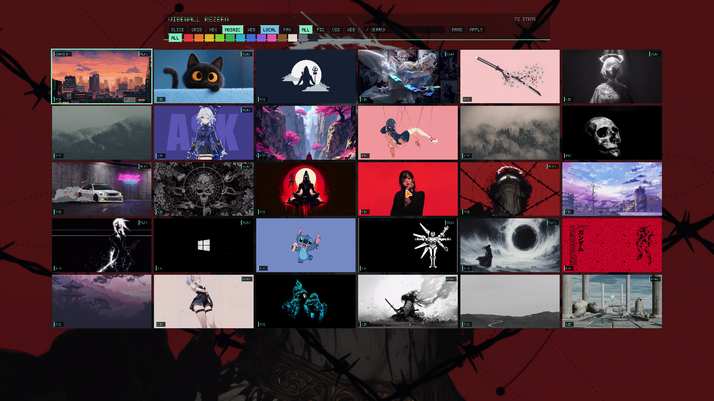
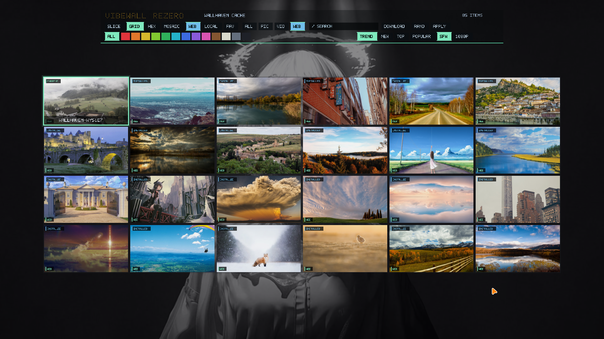

# vibewallREzero

Native C++ rewrite of the `skwd-wall` workflow for the Asura XS15 NixOS
desktop. It uses the local reference at `/home/asura/Downloads/skwd-wall-main`
for workflow and visual behavior, but does not use Qt, QML, Quickshell, GTK,
Tauri, Electron, or WebKit.

## Features

- Tiny daemon plus short-lived native picker.
- Native Wayland layer-shell overlay with OpenGL ES rendering.
- Reference-inspired modes: slice carousel, grid, hex, mosaic, and Wallhaven browser.
- Systemd-backed `vibewall toggle` startup, so the first `SUPER+W` press opens
  the picker instead of only waking the daemon.
- Click outside the centered picker stage to close.
- Full-opacity wallpaper previews with aspect-ratio cover cropping; only the
  shell dim layer is translucent.
- SQLite wallpaper database with tags, favourites, filters, colour groups, and
  last-used restore state.
- Image thumbnails through libvips and video thumbnails through ffmpeg.
- Wallhaven paginated search/cache/download/apply.
- Wallhaven card click selects only; `DOWNLOAD`/`D` saves the remote image, and `APPLY`/`Enter` downloads then applies it.
- Image backend: `noctalia msg wallpaper-set`.
- Video backend: `mpvpaper`.
- Theme hook: `matugen image`.

## Build

```bash
meson setup build
meson compile -C build
meson test -C build
```

## Commands

```bash
vibewall scan
vibewall toggle
vibewall picker --mode slice
vibewall picker --mode grid
vibewall picker --mode hex
vibewall picker --mode mosaic
vibewall picker --wallhaven
vibewall apply /path/to/wallpaper.png
vibewall random
vibewall restore
vibewall wallhaven search "city night" --page 1
```

## Picker Keys

| Key | Action |
|---|---|
| `1` | Slice mode |
| `2` | Grid mode |
| `3` | Hex mode |
| `4` | Mosaic mode |
| `Left/Right/Up/Down` | Navigate |
| `Enter` | Apply selected; Wallhaven downloads then applies |
| `D` | Download selected Wallhaven wallpaper without applying |
| `F` | Toggle favourite |
| `W` | Search/cache Wallhaven and show remote previews |
| `L` | Return to local wallpapers |
| `R` | Apply random wallpaper |
| `/` | Edit search |
| `Backspace` | Delete search char |
| `Escape` / outside click | Close |

## Screenshots

| Slice | Grid |
|---|---|
|  |  |

| Hex | Video wallpaper |
|---|---|
|  |  |

| Mosaic | Wallhaven |
|---|---|
|  |  |

## NixOS

The module at `nix/module.nix` installs the package, enables the user daemon,
and exposes a `programs.vibewallREzero` option set.

## Performance

The daemon intentionally does not link Wayland/EGL/OpenGL/libvips/curl UI
paths. Heavy indexing, thumbnailing, Wallhaven, and rendering happen in
short-lived processes.

Run:

```bash
benchmark.sh
```

Recent package benchmark on the Asura XS15:

```text
daemon_rss_kb=2844
picker_startup_ms=1642
picker_ready_rss_kb=252828
picker_idle_cpu_ticks_10s=0
idle_redraw_policy=event-driven
```

## Framework Boundary

This project intentionally does not use Qt, QML, Quickshell, GTK, Tauri,
Electron, WebKit, Steam Workshop, Wallpaper Engine scenes, or local AI tagging.
The UI process is native Wayland/EGL/OpenGL ES and short-lived; the daemon stays
small and IPC-only.
